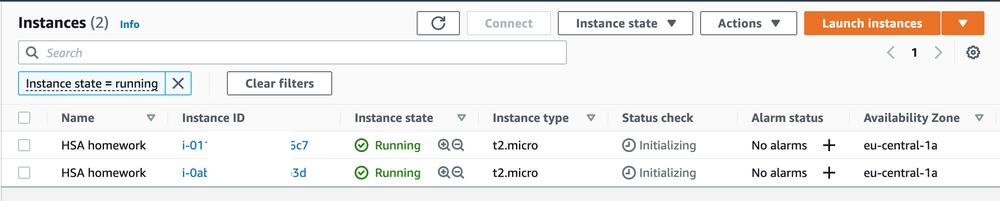
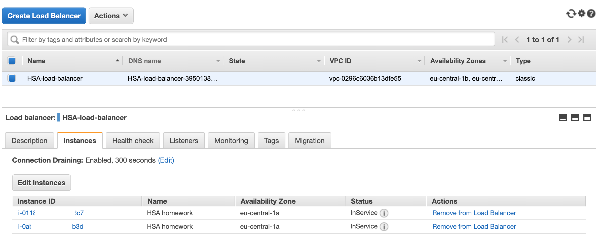
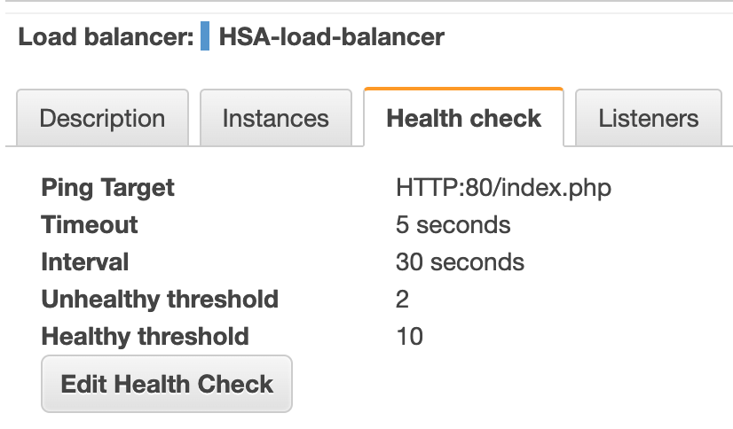
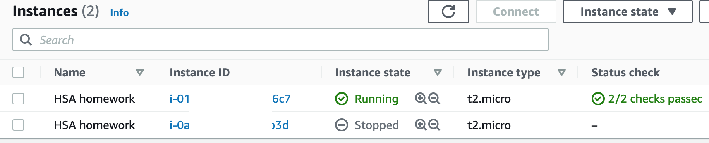
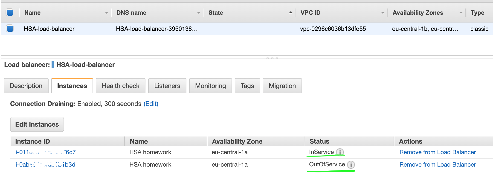

# HSA L23: AWS EC2 and Load Balancer

## Task
* Create 2 EC2 micro instances in AWS.
* Setup classic load balancer and assign instances to it.

## Getting Started
### Create 2 EC2 micro instances


### Check instances 
Note: I've changed EC2 instance endpoints for security reasons.

##### 1st instance
```bash
$ curl -XGET ec2----------131.eu-central-1.compute.amazonaws.com              
<!DOCTYPE html>
<html lang="en">
<head>
    <meta charset="UTF-8">
    <meta name="viewport" content="width=device-width, initial-scale=1.0">
    <meta http-equiv="X-UA-Compatible" content="ie=edge">
    <title>HSA Demo</title>
</head>
<body>
<h1>Welcome to HSA Instance #1</h1>
<div> Current time: Mon Feb 07, 2022 13:20 pm </div>
</body>
</html>
```

##### 2nd instance
```bash
$ curl -XGET ec2-----------110.eu-central-1.compute.amazonaws.com

<!DOCTYPE html>
<html lang="en">
<head>
    <meta charset="UTF-8">
    <meta name="viewport" content="width=device-width, initial-scale=1.0">
    <meta http-equiv="X-UA-Compatible" content="ie=edge">
    <title>HSA Demo</title>
</head>
<body>
<h1>Welcome to HSA Instance #2</h1>
<div> Current time: Mon Feb 07, 2022 13:21 pm </div>
</body>
</html>
```

### Create load balancer for instances.





### Check that load balancer return difference instances
First request
```bash
$ curl -XGET hsa-lb-demo-000000000.eu-central-1.elb.amazonaws.com

<!DOCTYPE html>
<html lang="en">
<head>
    <meta charset="UTF-8">
    <meta name="viewport" content="width=device-width, initial-scale=1.0">
    <meta http-equiv="X-UA-Compatible" content="ie=edge">
    <title>HSA Demo</title>
</head>
<body>
<h1>Welcome to HSA Instance #1</h1>
<div> Current time: Mon Feb 07, 2022 14:52 pm </div>
</body>
```

Second request
```bash
$ curl -XGET hsa-lb-demo-000000000.eu-central-1.elb.amazonaws.com

<!DOCTYPE html>
<html lang="en">
<head>
    <meta charset="UTF-8">
    <meta name="viewport" content="width=device-width, initial-scale=1.0">
    <meta http-equiv="X-UA-Compatible" content="ie=edge">
    <title>HSA Demo</title>
</head>
<body>
<h1>Welcome to HSA Instance #2</h1>
<div> Current time: Mon Feb 07, 2022 14:53 pm </div>
</body>
```

### Check instances with Siege
```bash
$ siege -c100 -t30S hsa-lb-demo-611459660.eu-central-1.elb.amazonaws.com

Lifting the server siege...
Transactions:		        2504 hits
Availability:		      100.00 %
Elapsed time:		       29.60 secs
Data transferred:	        0.80 MB
Response time:		        0.76 secs
Transaction rate:	       84.59 trans/sec
Throughput:		        0.03 MB/sec
Concurrency:		       64.31
Successful transactions:        2504
Failed transactions:	           0
Longest transaction:	       19.09
Shortest transaction:	        0.07
```

### Disable one of the instances. Check that 1 is still available and another is down.



### The Second instance is out of service

